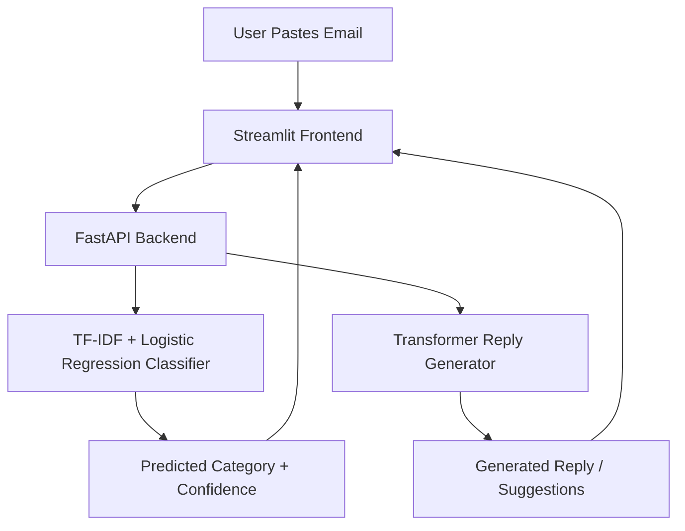

# 📧 Smart Email Reply System using Machine Learning & NLP

An AI-powered application that **categorizes incoming emails** and **automatically generates professional replies** in real time.
Built using **Python, FastAPI, PyTorch/Transformers, Scikit-learn, and Streamlit**.

## Project Overview

Manually reading, categorizing, and replying to emails is repetitive and time-consuming. This project automates the process using a combination of classical Machine Learning and modern NLP.

Users can paste any email, and the system predicts its intent and generates a ready-to-send reply using a fine-tuned Transformer model.

## System Architecture

## How It Works

1. **Email Categorization**
   - Cleans and extracts the email body text
   - Vectorizes the text using **TF-IDF** (unigrams + bigrams, up to 15,000 features)
   - Predicts one of four categories using a tuned **Logistic Regression** model (target accuracy ~95–96%)

2. **Reply Generation**
   - Sends the email text to a fine-tuned **Transformer model** (PyTorch + Hugging Face)
   - Generates either a single reply or three distinct suggestions
   - Post-processes the output (removes boilerplate prefixes, fixes spacing, formats the signature block) for a clean, email-ready format

3. **API Layer**
   - `POST /categorize` → returns predicted category + confidence score
   - `POST /generate-reply` → returns a single reply or a list of suggestions
   - `GET /health` → health check used by the frontend to auto-detect a running backend

4. **Frontend**
   - Streamlit app lets you paste a custom email or pick from sample emails (project updates, HR requests, meeting scheduling, expense queries, announcements)
   - Displays the predicted intent, model confidence, and the generated reply in a styled card
   - Supports a "Single Reply" or "Multiple Suggestions (3)" mode

## Tech Stack

| Component              | Technology                          |
|-------------------------|--------------------------------------|
| Programming Language    | Python                              |
| Frontend                | Streamlit                           |
| Backend / API           | FastAPI, Uvicorn                    |
| Classification Model    | Scikit-learn (TF-IDF + Logistic Regression) |
| Reply Generation Model  | PyTorch, Hugging Face Transformers  |
| Data Handling           | Pandas, NumPy, Datasets             |
| Evaluation              | Evaluate, ROUGE Score               |
| NLP Utilities           | NLTK                                |
| Experimentation         | Jupyter, Matplotlib, Seaborn        |

## Features

- Real-time email categorization into 4 intent classes
- AI-generated, context-aware email replies
- Option to generate multiple distinct reply suggestions
- Confidence score displayed alongside the predicted category
- Clean, dark-themed Streamlit interface with sample emails for quick testing
- FastAPI backend with auto-detected local server URL
- Modular structure separating training, API, and frontend code

## Project Structure
