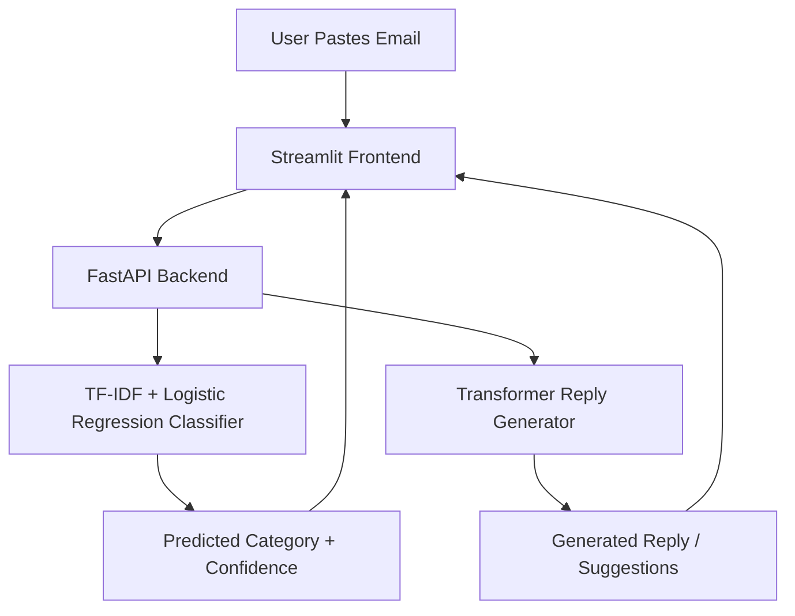

# 📧 Smart Email Reply System using Machine Learning & NLP

An AI-powered application that **categorizes incoming emails** and **automatically generates professional replies** in real time.
Built using **Python, FastAPI, PyTorch/Transformers, Scikit-learn, and Streamlit**.

## Project Overview

Manually reading, categorizing, and replying to emails is repetitive and time-consuming. This project automates the process using a combination of classical Machine Learning and modern NLP.

Users can paste any email, and the system predicts its intent and generates a ready-to-send reply using a fine-tuned Transformer model.

## System Architecture



## How It Works

1. **Email Categorization**
   - Cleans and extracts the email body text
   - Vectorizes the text using **TF-IDF** (unigrams + bigrams, up to 15,000 features)
   - Predicts one of four categories using a tuned **Logistic Regression** model (target accuracy ~95–96%)

2. **Reply Generation**
   - Sends the email text to a fine-tuned **Transformer model** (PyTorch + Hugging Face)
   - Generates either a single reply or three distinct suggestions
   - Post-processes the output (removes boilerplate prefixes, fixes spacing, formats the signature block) for a clean, email-ready format

3. **API Layer**
   - `POST /categorize` → returns predicted category + confidence score
   - `POST /generate-reply` → returns a single reply or a list of suggestions
   - `GET /health` → health check used by the frontend to auto-detect a running backend

4. **Frontend**
   - Streamlit app lets you paste a custom email or pick from sample emails (project updates, HR requests, meeting scheduling, expense queries, announcements)
   - Displays the predicted intent, model confidence, and the generated reply in a styled card
   - Supports a "Single Reply" or "Multiple Suggestions (3)" mode

## Tech Stack

| Component              | Technology                          |
|-------------------------|--------------------------------------|
| Programming Language    | Python                              |
| Frontend                | Streamlit                           |
| Backend / API           | FastAPI, Uvicorn                    |
| Classification Model    | Scikit-learn (TF-IDF + Logistic Regression) |
| Reply Generation Model  | PyTorch, Hugging Face Transformers  |
| Data Handling           | Pandas, NumPy, Datasets             |
| Evaluation              | Evaluate, ROUGE Score               |
| NLP Utilities           | NLTK                                |
| Experimentation         | Jupyter, Matplotlib, Seaborn        |

## Features

- Real-time email categorization into 4 intent classes
- AI-generated, context-aware email replies
- Option to generate multiple distinct reply suggestions
- Confidence score displayed alongside the predicted category
- Clean, dark-themed Streamlit interface with sample emails for quick testing
- FastAPI backend with auto-detected local server URL
- Modular structure separating training, API, and frontend code

## Project Structure

```
EMAIL_ML_PROJECT/
│
├── api/                     # FastAPI backend (categorization + reply generation endpoints)
├── data/
│   └── processed/           # Processed/cleaned datasets used for training
├── models/                  # Saved model artifacts (e.g., email_classifier.pkl)
├── notebooks/                # Notebooks for experimentation and model exploration
├── src/                      # Core source code / shared utilities
├── app.py                    # Streamlit frontend application
├── train_classifier.py       # Trains the TF-IDF + Logistic Regression classifier
├── create_test_data.py       # Generates sample/test email data
├── check_data.py             # Data validation and inspection script
├── test_api.py                # Tests for the FastAPI endpoints
├── test_generator.py          # Tests for the reply generation model
└── requirements.txt           # Project dependencies
```
## How to Run Locally

```bash
# Clone the repository
git clone https://github.com/ankitabehera888/-EMAIL_ML_PROJECT.git

# Navigate into the directory
cd -EMAIL_ML_PROJECT

# Install dependencies
pip install -r requirements.txt

# Train the classifier (optional, if models/ is not already populated)
python train_classifier.py

# Start the FastAPI backend
uvicorn api.main:app --reload --port 8000

# In a separate terminal, start the Streamlit frontend
streamlit run app.py
```

Then open the displayed local URL in your browser, paste an email (or pick a sample), and click **Process Email**.

> **Note:** Update the FastAPI entry point in the `uvicorn` command above (`api.main:app`) if your API module/file is named differently inside the `api/` folder.

## Future Improvements

- Deploy the FastAPI backend and Streamlit frontend to a cloud platform (Render/HuggingFace Spaces)
- Expand email categories and fine-tune the generative model on a larger, domain-specific dataset
- Add authentication and email inbox integration (Gmail/Outlook API)
- Add unit test coverage reporting and CI/CD pipeline

## License

This project is open-source and available for educational and personal use.
